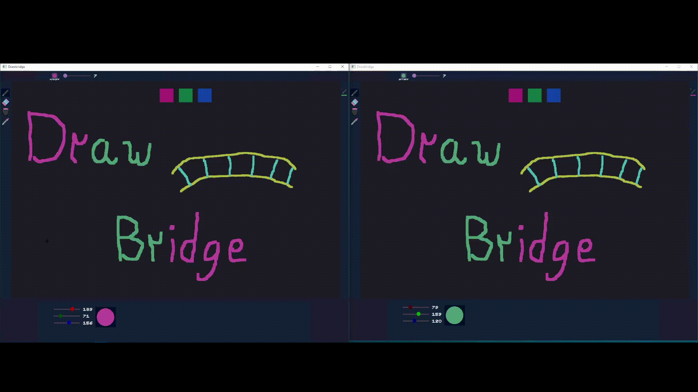
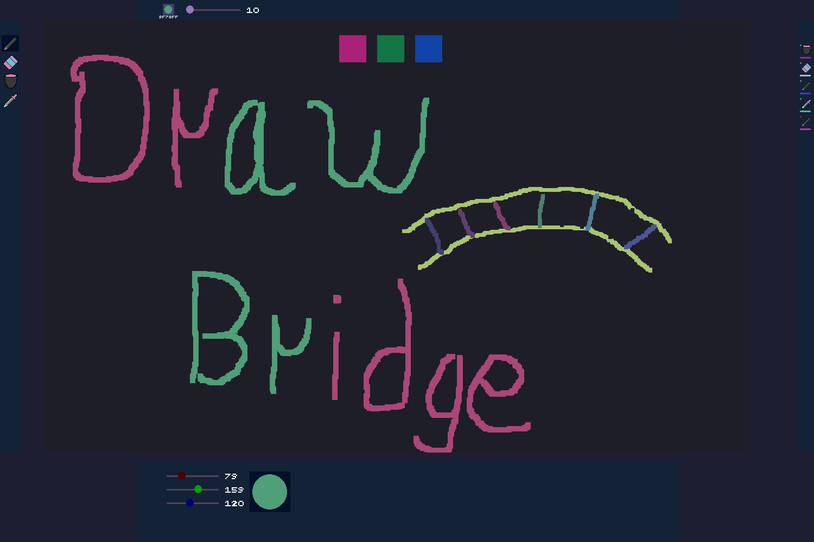

# Drawbridge #

## What is _Drawbridge_? ##
_Drawbridge_ is a simple paint program with a twist. It allows multiple people to connect to the same canvas, via the internet.  
  

### Requirements: ###
All you need is an internet connection, Linux or Windows, and an x86\_64 CPU.  
If you don't want to build the program from source, you can find the binaries in the [releases](https://github.com/davis-b/drawbridge/releases/tag/v1.0.0) page.

#### Build requirements: ####
If you're building _Drawbdrige_ from source, you will need:

* The Zig compiler, version 0.8.
* SDL header files.

That's it! SDL is the only dependency.

From there, the process is as simple as:  
`git clone https://github.com/davis-b/drawbridge`  
`cd drawbridge`  
`git submodule init`  
`git submodule update`  
`zig build -Drelease-safe`  
_Drawbridge_ should be built and the binary should reside in the zig-out/bin/ folder of the project directory.

- - -

## Getting started; How to use ##

### Connecting to a server ###

To interact with other people, you'll need to be connected to the same server as them.  
To connect to a server, you will want to call _Drawbridge_ on the command line with the following argument:
`-ip <ip of the server>`. However, of course, you will need to replace the `<>` segment with the actual server's IP.   
There are no official _Drawbridge_ servers. However, it is easy to host one. 

### Hosting a server ### 

To host a _Drawbridge_ server, you can simply run the 'drawbridge-server' executable.  
Server hosting is only available on linux. If you are on Windows, you can look into using WSL to work around this.  
By default, it will host on port 9890 on any available address. If your server is located behind a firewall, as is typical with home router setups, you will need to forward that port to allow other users to connect to your server.

### The program itself ###

Once you're connected to a room with other people, _Drawbridge_ should be at least somewhat intuitive.  
  
The left GUI bar contains your available tools. You can click on their icons or press 1-4 on your keyboard to switch your active tool.  
The top GUI bar contains some information about your active tool, including an interactive slider to determine the tool's size.  
The bottom GUI bar contains your active color, as well as RGB sliders allowing you to modify your color.  
The right GUI bar contains information about the peers you are connected to, including their active tool, color, and activity state.  

- - -

## How _Drawbridge_ works ##

_Drawbridge_ sends action packets to a _Drawbridge_ server. The server then forwards those packets any other clients connected to the same drawing room. They are then replayed as if they originated on the receiving client.  

Action packets are used to represent any input that needs to be shared over the network.  
Instead of drawing a line and sharing the changed image data, we instead share the same actions we operated on to draw that line.
Those actions would be something along the lines of `start drawing at (x, y)` followed by a series of `move cursor (x, y)`, and finally a `stop drawing` action.

- - -

## Features ##
* Share a drawing canvas with other people, over the internet.
* A few basic drawing tools
* Low bandwith operation. Only the minimum amount of data is sent over the internet.

## To Do: ##
* Connect to a server without relying on the command line
* Compress the canvas before sending it to new peers
* Allow each user to have their own drawing layer
* Use GPU rendering instead of CPU surface rendering
* Tooltips
* Undo/Redo
* Dynamic image size
* Canvas crop indicator
* Ability to zoom in/out
* Better fit GUI to any given window size
* Give the GUI a bit more polish
* Include more tools, and more tool options
